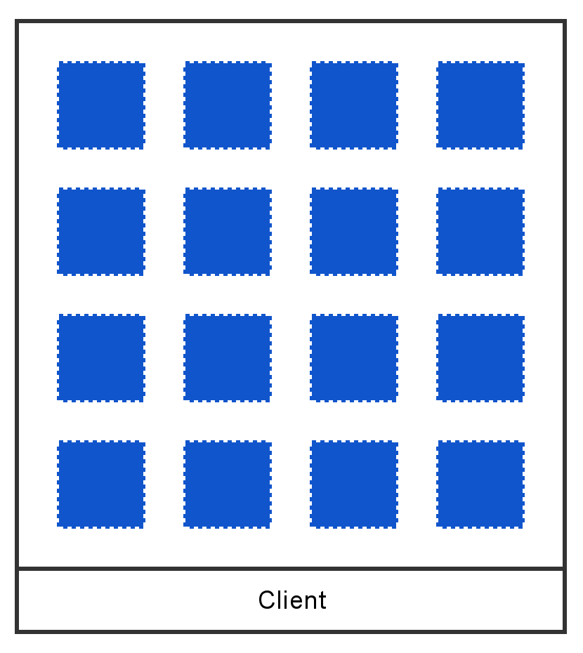
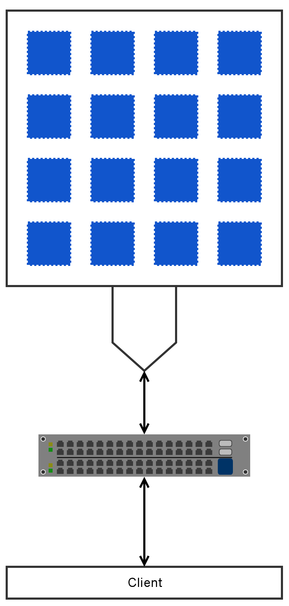
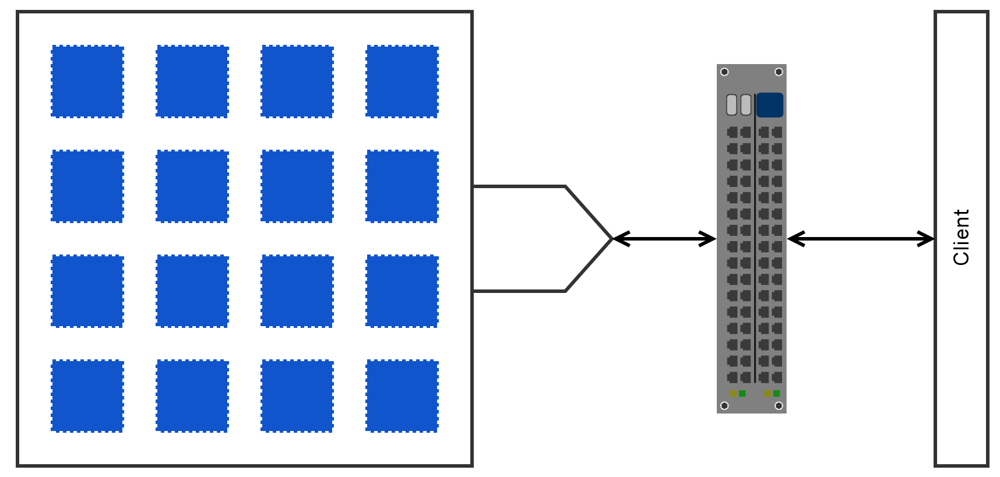
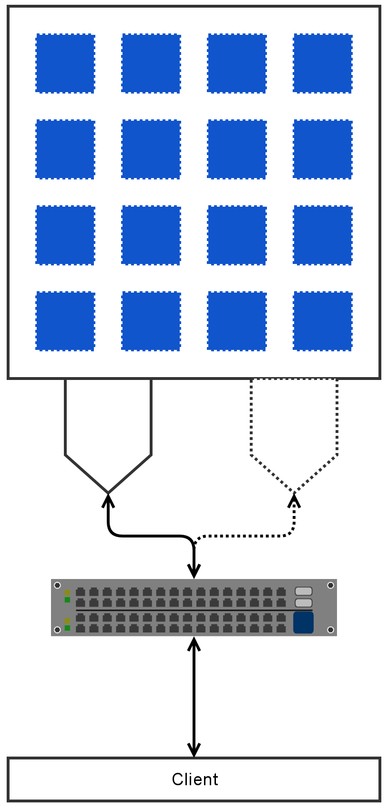
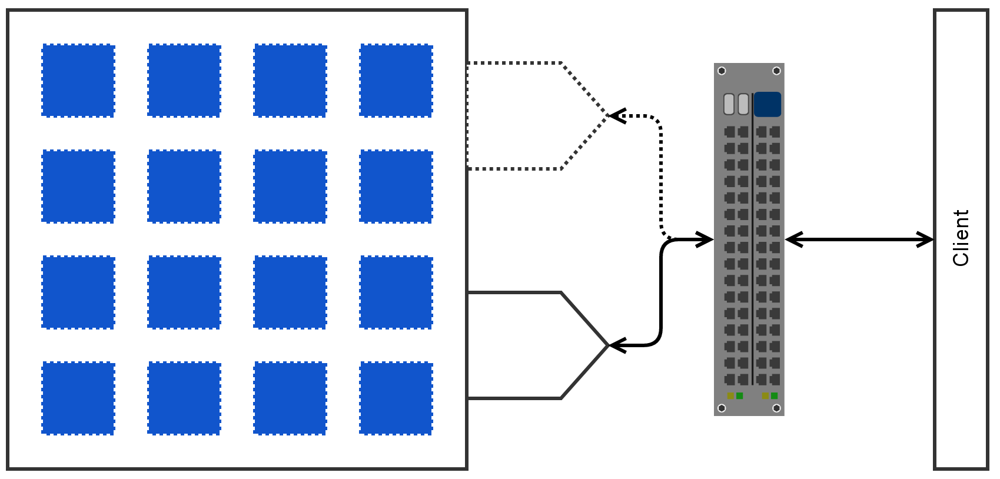
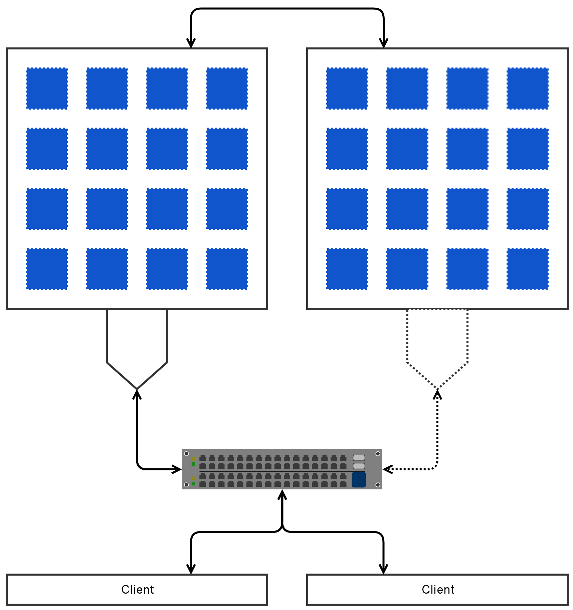
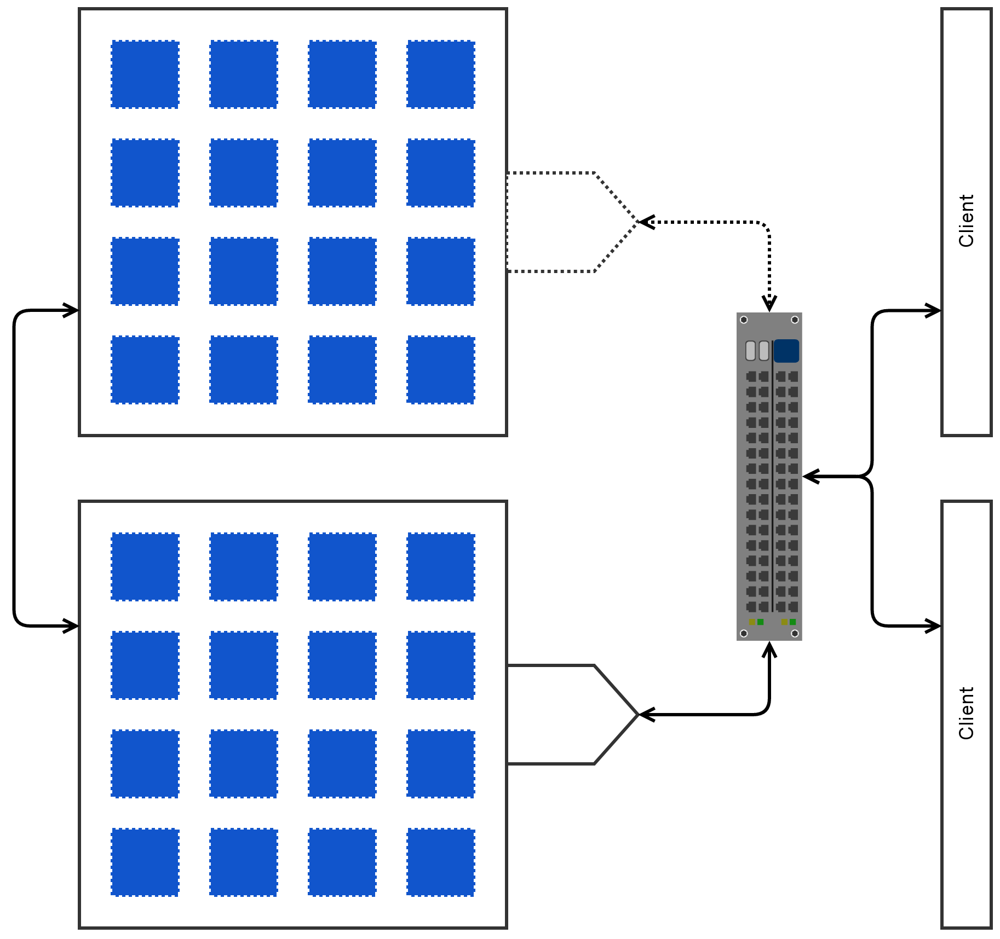
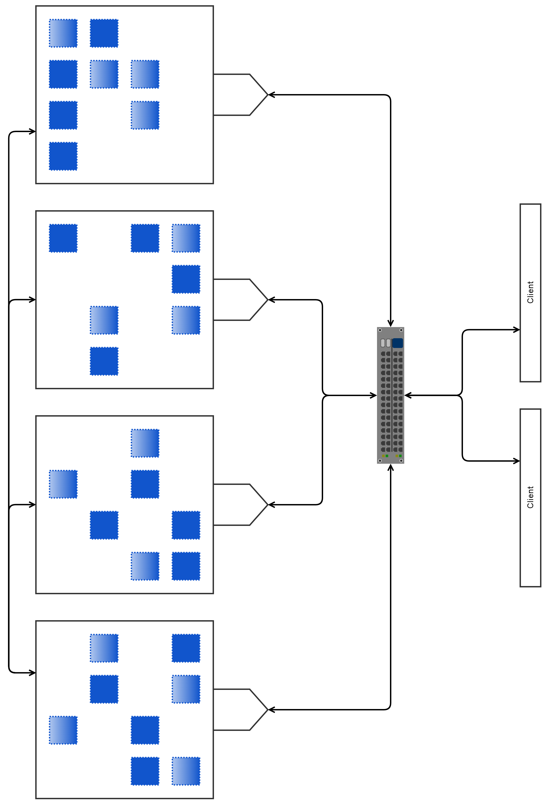

!SLIDE subsection
#~~~SECTION:MAJOR~~~ Storage - a quick overview

~~~SECTION:notes~~~
Introduction: which kinds of storage are used/known?
 
take notes and categorize into 
DAS, SAN, NAS/ Shared, Block, Object Store 
~~~ENDSECTION~~~

!SLIDE smbullets noprint
# Objectives

* after this section you will be able to distinct different storage types
  
 shared filesystem  
  block storage  
  object store  
  comparision 

!SLIDE smbullets
# Shared Filesystem

* concurrent access of several clients
* access via network
* usually compatible to POSIX
* integrated as 'local' file system
* e.g. CIFS, NFS and CephFS

~~~SECTION:notes~~~
NFS (usually FS on BlockStorage) 
CephFS (FS on ObjectStore) 

Files organized via path hierachy and metadata 
~~~ENDSECTION~~~

!SLIDE smbullets
# Block Storage

* local disks, iSCSI, RBD
* accessed locally or via network
* fast
* good in random access
* usually with an FS on top

~~~SECTION:notes~~~
DAS (direct attached storage): e.g. local disks  
SAN (Storage Area Network): extension of DAS, iSCSI, RBD (Block devics) 
NAS (Network Attached Storage): FS via Network (CIFS, NFS, CephFS) 

NFS (usually FS on BlockStorage) 
CephFS (FS on ObjectStore) 
~~~ENDSECTION~~~

!SLIDE lrbullets small
# Object Store

* access via API
* stores data in a flat 'hierarchy' like pools
* used for unstructured data
* used for large amount of data
* no posix tools
* easy to scale
* mostly what is sold as cloud storage
* often used for media, documents, archives, images
* an object comprises of Object-ID, Data, Metadata, Attributes

!SLIDE lrbullets small
# Differences Object Store - Block Storage

* no hierarchy by folders
* faster access of unstructured data
* more attributes
* more flexible attributes
* searchable by attributes
* applications have to support different access type
* or storage has to provide gateways

~~~SECTION:notes~~~
Objects (comprised of Metadata, Data, ID) instead of hierarchy 
Metadata (creation time, size, ownership)
Attributes (access patterns, content, retention)
Examples: S3, RADOS, Swift 
~~~ENDSECTION~~~

!SLIDE smbullets
# Visualization

!SLIDE noprint 
# local

 

!SLIDE printonly
# local

 

!SLIDE noprint 
# network
 

!SLIDE printonly 
# network
 

~~~SECTION:notes~~~
* e.g. NetApp
~~~ENDSECTION~~~

!SLIDE noprint 
# network, failover
 

!SLIDE printonly 
# network, failover
 

~~~SECTION:notes~~~
* e.g. NetApp with two heads
~~~ENDSECTION~~~

!SLIDE noprint 
# network, failover, replicated
 

~~~SECTION:notes~~~
* point out backend replication
~~~ENDSECTION~~~

!SLIDE printonly
# network, failover, replicated
 

~~~SECTION:notes~~~
* e.g. NetApp MetroCluster?
~~~ENDSECTION~~~

!SLIDE noprint
# network, replicated, distributed, high-available

~~~SECTION:notes~~~
* e.g. Ceph
~~~ENDSECTION~~~

!SLIDE printonly
# network, replicated, distributed, high-available
 

~~~SECTION:notes~~~
stress that Ceph offers all three kinds of Storage.
~~~ENDSECTION~~~
