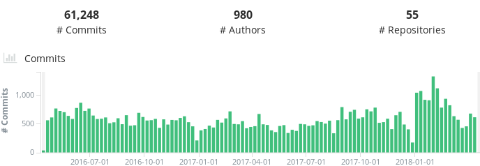
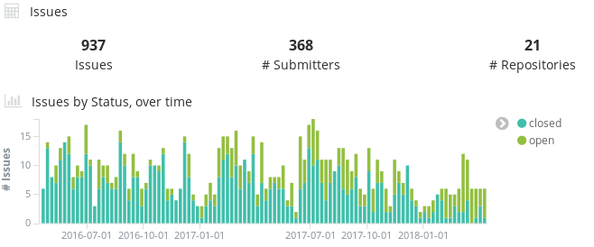
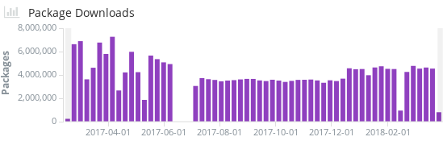
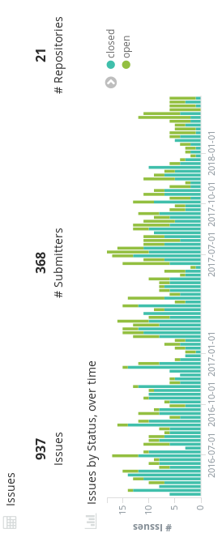
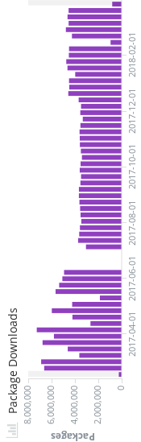
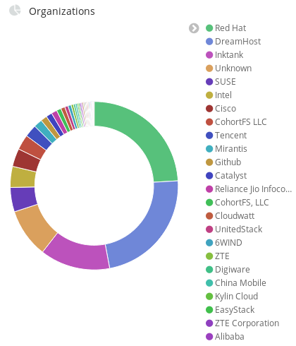

!SLIDE subsection
#~~~SECTION:MAJOR~~~ Ceph - a unified, distributed storage

         

~~~SECTION:notes~~~
* unified: access on Block Device(rbd) and File (RadosGW/CephFS) and Object
  Store
~~~ENDSECTION~~~

!SLIDE smbullets small
#~~~SECTION:MINOR~~~ The Ceph Project
 

 

* 2007: started by Sage Weil for his dissertation at the University of California (2007)
* 2012: First stable release and foundation of InkTank
* 2014: Takeover by RedHat
* 2016, April: Jewel is released with CephFS marked as stable
* 2017, August: Luminous released with ceph-mgr
* 2018, May: Mimic released with new release cycle

~~~SECTION:notes~~~
funded by the United States Department of Energy and National Nuclear Security Administration
also funded by Canonical  
new cycle since Mimic: LTS every 9 Months, before: every second release was LTS/stable 
taken initially from https://metrics.ceph.com/scm.html,  
now http://stackalytics.com/?release=all&project_type=ceph-group&metric=loc can be an alternative
~~~ENDSECTION~~~

!SLIDE noprint
# Ceph in numbers

---

https://metrics.ceph.com/

!SLIDE printonly
# Ceph in numbers

https://metrics.ceph.com/

!SLIDE noprint
# Who is Ceph?

https://metrics.ceph.com/

!SLIDE printonly
# Who is Ceph?

https://metrics.ceph.com/

