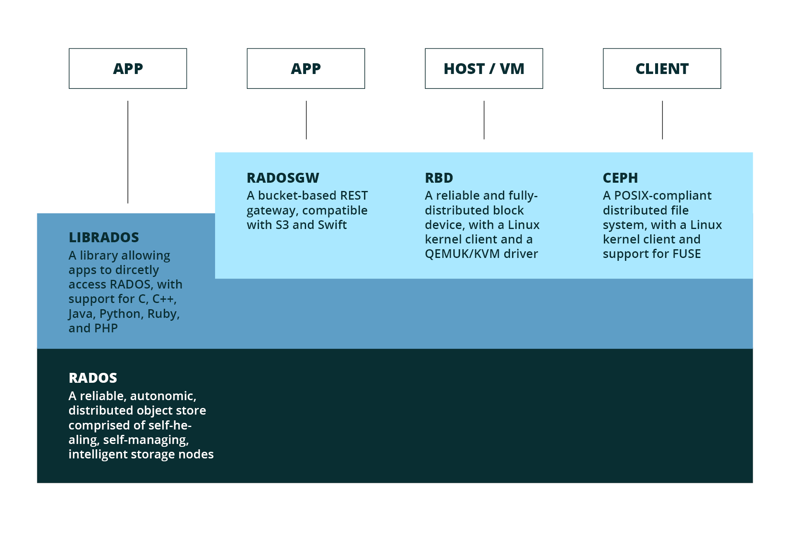

!SLIDE 
#~~~SECTION:MINOR~~~ Ceph Storage Cluster 

!SLIDE noprint smbullets

# Objectives

* after this section you will unterstand the  
 structure of the main components of a Ceph Storage Cluster  
  * RADOS 

* use and interplay between the components 
  * OSD
  * Monitors
  * Pools
  * Placement Groups

!SLIDE noprint
# Holistic

!SLIDE noprint
# Components

!SLIDE printonly
# Components

!SLIDE tdbullets
# RADOS

 

* R_eliable
 
* A_utonomic
 
* D_istributed
 
* O_bject 
 S_tore

~~~SECTION:notes~~~
reliable: because it's replicated and can handle failures 
autonomic: self-healing on failures 
distributed: distributed to failure domains => datacenters, racks, switch, server 
~~~ENDSECTION~~~

!SLIDE lrbullets 
# RADOS FEATURES

* highly scaleable
* self healing
* flexible
* unified
* no SPoF
* commodity hardware

~~~SECTION:notes~~~
flexible: data placement (Failure Domains, fast OSDs vs slow OSDs) 
unified und flexible because of block, cephfs and object 
no SPoF correct for RADOS,RBD and RADOSGW BUT not CephFS (mds) 
~~~ENDSECTION~~~

!SLIDE smbullets
# RADOS Components
 

* Object Storage Daemons (OSDs)
 * essentially represent a disk
 * store data (objects)

* Monitors
 * are aware of the cluster state
 * form the quorum 

* Pools
 * logical partition of data

* Placement Groups (PG)
 * one pool has many PGs

~~~SECTION:notes~~~
osd: reads + writes data. communicate to each other for self-healing. 
osd: communicates to monitors to deliver state 
mons: manage and know the osd states  
pgs: logical abstraction layer, needed for calculation of data placement 
~~~ENDSECTION~~~
