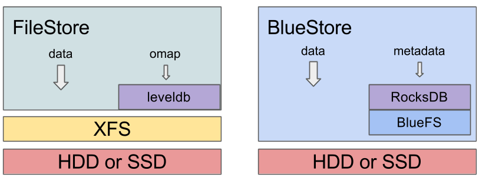

!SLIDE noprint
#~~~SECTION:MINOR~~~ What else?

 

!SLIDE printonly
#~~~SECTION:MINOR~~~ What else?

 

!SLIDE smbullets noprint
# Objectives

* after this section you will
 * know the data integrity mechanism
 * see several encryption methods
 * know how to use CephX (authentication and authorization)
 * know several PG states
 * have an overview on Erasure Coding
 * see basic trouble shooting
 * have knowledge about Luminous

!SLIDE smbullets
# Scrubbing

Ensures data integrity by comparing the replicas of an object. 
Scrubbing is always performed for all objects within a single PG.

* scrubbing
 * verifies metadata
 * verifies object size
 * daily

* deep-scrubbing
 * verifies content
 * weekly
 * IO intensive
 * is started by a common scrub

!SLIDE smbullets
# Scrubbing: 
# reduce IO impact

* osd max scrubs
 * maximum number of simultaneous scrubs per OSD
* osd scrub load threshold
 * scrub only if load is smaller than given value
* osd scrub max interval
 * ignore all other settings
* osd deep scrub interval 

* osd scrub begin hour: 0-24
* osd scrub end hour: 0-24

!SLIDE smbullets
# Encryption: Software, Physical, Not

* Software - ceph-deploy create OSD --dmcrypt
  * both journal and data encrypted
  * keys stored in MON database
  * unencrypted bootstrap key for communication
  * CPU intensive

* Physical - Self Encrypting Drives
  * more pricey
  * transparent to Ceph
  * cumbersome key management

* Not:
  * data are split per object size
  * over the whole cluster
  * according to failure domains

!SLIDE smbullets
# CephX: authentication and authorization

 

Clients are authenticated with a shared secret method. 
For communication to OSDs and MDS, the clients retrieve an encrypted ticket from the monitor servers. 
Monitors, OSDs and MDS share a secret to verify the tickets.

* secrets are saved as plaintext
* no data encryption provided

!SLIDE small
# CephX Commands: 
# ceph auth

list users

    # ceph auth list

get the key and capabilities for the admin client

    # ceph auth get client.admin

create a new user 

    # ceph auth get-or-create client.paul mon 'allow r' osd 'allow rw pool=liverpool'

change != add caps
    
    # ceph auth caps client.paul mon 'allow r' osd 'allow rwx pool=swimmingpool'

remove a user

    # ceph auth del client.paul

!SLIDE smbullets
# EC: Erasure coded pool

* didn't do exactly well with jewel and RBD
* requires less space (compared to replicated pools)
* often used for cold storage (in combination with a replicated cache tier)
* provides fewer features (compared to replicated pools)
* similar to RAID-5/6
* data are split in data chunks and coding chunks (parity)
* EC(6,3) split data in 6 data chunks and 3 coding chunks
 * 3 OSDs may fail

!SLIDE small
# EC Commands: 
# create an EC Pool
    

create myprofile and set k, m and the crush rule
    
    # ceph osd erasure-code-profile set myprofile k=6 m=3
    # ceph osd erasure-code-profile get myprofile

show EC profiles

    # ceph osd erasure-code-profile ls
    # ceph osd erasure-code-profile get myprofile

    # ceph osd erasure-code-profile rm myprofile

create pool

    # ceph osd pool create my-ec-pool 128 128 erasure \
      myprofile my-crush-root

!SLIDE small printonly
# PG states

* active

    PG is ready for requests

* clean

    replication state for PG is optimal

* remapped

    PG is mapped to another set of OSDs

* degraded
   
    replicas are not complete

* backfilling

    ceph is synchronizing the entire content of a PG

* recovering

    PG is synchronizing replicas

* scrubbing

    check PG for consistency

* stale

    PG is in an unknown state

See PG states: http://docs.ceph.com/docs/master/rados/operations/pg-states

!SLIDE small noprint
# PG states

* active

    PG is ready for requests

* clean

    replication state for PG is optimal

* remapped

    PG is mapped to another set of OSDs

* degraded
   
    replicas are not complete

* backfilling

    ceph is synchronizing the entire content of a PG

!SLIDE small noprint
# PG states

* recovering

    PG is synchronizing replicas

* scrubbing

    check PG for consistency

* stale

    PG is in an unknown state

See [PG states](http://docs.ceph.com/docs/master/rados/operations/pg-states).

!SLIDE small
# What if... an OSD is full

* HEALTH_WARN: near full at 85%
* HEALTH_ERR: full at 95%
* ceph prevents from writing data
* Solution: 
 * add new OSDs
 * if not possible, remove PG directories on the full OSD (dangerous) and
   prevent backfilling
 * reweight 

!SLIDE small
# What if... there are slow requests

* read/write processes are not served within 30 seconds
 * if necessary set: osd_op_complaint_time
* Reasons:
 * bad drives (dmesg/smart)
 * overload (iostat/top)
 * bugs (kernel or osd)
* Solutions:
 * restart involved OSDs
 * upgrade kernel and ceph (cluster and clients)
 * extend the cluster (remove the bottleneck)

!SLIDE small
# What if... 

 

backfilling impacts the client io

* reduce the max number of backfill jobs per OSD
 * osd_max_backfills 1 (default 10)

deleting snapshots impacts the client io

* throttle snap trimming
 * osd_snap_trim_sleep

!SLIDE small
# Tuning

* osd_op_threads
* TCMalloc vs. JEMalloc
* activate Jumbo Frames
* osd_mount_options_xfs: allocsize=4m,inode64,logbufs=8,logbsize=256k
* rbd: enable rbd cache (hypervisor) and writeback cache (qemu/kvm)
* set tcp_nodelay (man rbd)

!SLIDE small
# CBT - Ceph Benchmarking Tool

* CBT is built on FIO and radosbench
* FIO benchmarks with:
 * librbd
 * kvmrbd
 * rbdfio
* rados benchmarks with rados cli binary
* iperf
* c.f. https://github.com/ceph/cbt

!SLIDE small
# Luminous

* released in August 2017
changes regarding 
   * management 
   * OSD
   * Filesystem
   * compression and checksums
   * migration
* meanwhile Mimic with improved Tagging and Dashboard

!SLIDE small
# Luminous - management

  * ceph mgr takes load off of mon
  * ceph-deploy has different options
  * great performance gains especially in huge environments
  * plugin support improved
  * https://ceph.com/releases/v12-2-0-luminous-released/

~~~SECTION:notes~~~
ceph mgr module ls

~~~ENDSECTION~~~

!SLIDE small
# Luminous - OSD

  * device class
  * backoff mechanism
  * easier replacement

~~~SECTION:notes~~~

Replacing an OSD

When disks fail, or if an admnistrator wants to reprovision OSDs with a new backend, for instance, for switching from FileStore to BlueStore, OSDs need to be replaced. Unlike Removing the OSD, replaced OSD’s id and CRUSH map entry need to be keep intact after the OSD is destroyed for replacement.

    Destroy the OSD first:

    ceph osd destroy {id} --yes-i-really-mean-it

    Zap a disk for the new OSD, if the disk was used before for other purposes. It’s not necessary for a new disk:

    ceph-disk zap /dev/sdX

    Prepare the disk for replacement by using the previously destroyed OSD id:

    ceph-disk prepare --bluestore /dev/sdX  --osd-id {id} --osd-uuid `uuidgen`

    And activate the OSD:

    ceph-disk activate /dev/sdX1

 
~~~ENDSECTION~~~

!SLIDE small
# Luminous - Filesystem

  * Bluestore
  * introduced with Kraken, January 2017
  * default "filesystem" in Luminous
    * https://ceph.com/community/new-luminous-bluestore/

!SLIDE small noprint
# Luminous - Filesystem ctd.

  
  * RocksDB: key/value database manages internal metadata
  * BlueFS: basic file-system-like interface 
  * I/O directly against block device
  * WAL can be implemented
  * all components can be "mapped" against different devices

!SLIDE small printonly
# Luminous - Filesystem ctd.

  
  * RocksDB: key/value database manages internal metadata
  * BlueFS: basic file-system-like interface 
  * I/O directly against block device
  * WAL can be implemented
  * all components can be "mapped" against different devices

!SLIDE small
# Luminous - compression, checksums

  * zlib, snappy, or lz4
  * disabled by default
  * set per pool
   * http://docs.ceph.com/docs/master/rados/configuration/bluestore-config-ref/#inline-compression
  * checksums for all data and metadata
  * verification per each read access
  * default crc32c
    * optional: xxhash32, xxhash64, truncated crc32c, disabled

!SLIDE small
# Luminous - Migration
  
  * current OS with systemd
  * cluster can run mix of Bluestore and Filestore
  * new OSD will be provisioned with Bluestore by default
  * migration possible per OSD or host 
   * http://docs.ceph.com/docs/master/rados/operations/bluestore-migration/

 

!SLIDE small noprint
# Dashboard - Overview

!SLIDE small printonly

# Dashboard - Overview

!SLIDE small
# Dashboard - Overview ctd

  * basically a plugin
  * Mimic: huge influence by openATTIC
  * overall cluster health
  * performance counter

!SLIDE small
# Dashboard - setup

enable plugin
  
    # ceph mgr module enable dashboard

create certificate

    # ceph dashboard create-self-signed-cert

create an admistrative user for login

    # ceph dashboard set-login-credentials <username> <password> 

restart dashboard for mgr respawn

    # ceph mgr module disable dashboard
    # ceph mgr module enable dashboard

login
   
    https://$mgr-node:8443

more: http://docs.ceph.com/docs/master/mgr/dashboard/

