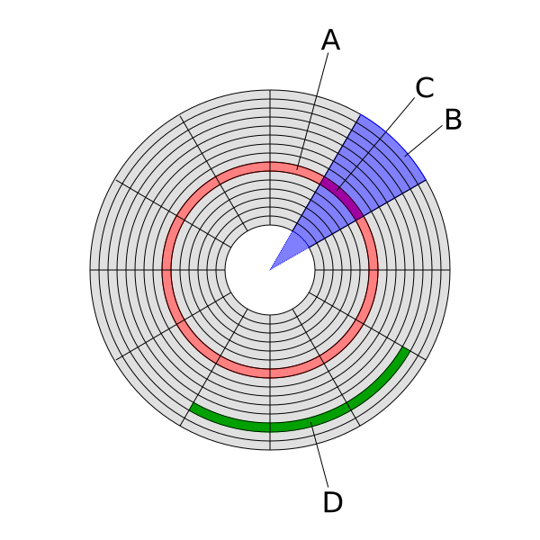
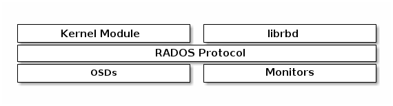

!SLIDE subsection
#~~~SECTION:MAJOR~~~ Rados Block Device (RBD)

!SLIDE noprint smbullets
# Objectives

* after this section you will know
 * how a block device is mapped to objects
 * how to interact with RBDs
 * snapshots and layering

!SLIDE noprint
# Holistic

!SLIDE
# Block Device structure

* split into many sectors
* sectors are the smallest unit
* with a fixed size (512B, 4KiB)
* introduced with magnetic HDDs

!SLIDE lrbullets smaller
# HDD structure

* A: Track
* B: Sector (geometrical)
* C: Sector (Track)
* D: Cluster
* ?: Head
* ?: Cylinder

!SLIDE smbullets
# Block Device as Objects

* group tracks sectors to objects
* default object size is 4MB
* 4MiB/512B = #sectors per Object
* a 4MiB object stores 8192 sectors

* sparse 'file'
* prefix for each RBD
* 4*4MiB objects
* list objects with `rados ls`
* 32768 sectors in 16MiB

~~~SECTION:notes~~~
C: 512byte see sgdisk -p /dev/sda
?: Cylinder are Tracks above each other
~~~ENDSECTION~~~

!SLIDE lrbullets small 
# RBD Commands: create, resize and remove

    # rbd create training --size 16M

    # rbd resize --size 250G [--allow-shrink] training

    # rbd info training
    rbd image 'training':
     	size 16384 kB in 4 objects
     	order 22 (4096 kB objects)
     	block_name_prefix: rbd_data.fa6a2ae8944a
     	format: 2
     	features: layering

    # rbd rm training

!SLIDE lrbullets noprint
# Access an RBD

<br\>

* Kernel v4.5 (recommended)
* Qemu >= 0.14.0 

~~~SECTION:notes~~~
current Kernel important for crush_tuneables
http://docs.ceph.com/docs/master/rados/operations/crush-map/#tunables

don't use Kernel 3.15 (bug)
Kernel 3.10, if inevitable (CentOS 7 default)
~~~ENDSECTION~~~

!SLIDE lrbullets printonly
# Access an RBD

<br\>

* Kernel v4.5 (recommeded)
* Qemu >= 0.14.0 

!SLIDE lrbullets small
# Access via kernel module

 

    # rbd map training
    /dev/rbd0

    # rbd showmapped
    id pool image    snap device    
    0  rbd  training -    /dev/rbd0 

    # rbd unmap /dev/rbd0

 

* rbd0 is a blockdevice
* mapping can be reboot save

!SLIDE
# Access via qemu-kvm integration

* support is built into qemu
* provide ceph credentials as [libvirt secret](https://libvirt.org/formatsecret.html#CephUsageType)
* a libvirt secret is linked to an attribute
 * e.g. an encrypted volume or a ceph pool/rbd

!SLIDE small
# Managing RBDs with qemu-img
 

    # qemu-img create -f raw rbd:foo/bar 10G

    # qemu-img convert -f qcow2 -O raw my_image.qcow2 \
      rbd:my_pool/my_pool

* qemu-img provides support for rbd manipulating images
* does not use the libvirt secret
* searches for default credentials in /etc/ceph/

!SLIDE small
# Lab: RBD Steps - 1

create and map an RBD

    # rbd create --size 2G myrbd
    # rbd map myrbd

create FS on the RBD

    # rbd showmapped
    # mkfs.ext4 /dev/rbd0

    # mount /dev/rbd0 /mnt

list connected clients

    # rbd status myrbd

!SLIDE small
# Lab: RBD Steps - 2

count the objects used by the RBD
    
    # rbd info myrbd
    # rados ls | grep <prefix> | wc -l

insert data and count again

    # rados ls | grep <prefix> | wc -l

!SLIDE small
# Commands: snapshot rbd 

create
  
    # rbd snap create <poolname>/<image>@<snapname>

list

    # rbd snap ls rbd/myimage

rollback
    
    # rbd snap rollback rbd/myimage@snapshot

delete

    # rbd snap rm rbd/myimage@snapshot

purge

    # rbd snap purge rbd/myimage

!SLIDE
# Layering

* a snapshot is a read-only image
* a protected snapshot cannot be deleted
* a clone from a snapshot is a read-write image

!SLIDE
# Layering: use case

* golden images
* applications with hierarchical structure
* template pool for cloning into other pools
* image migration/recovery

!SLIDE  small
# Layering Commands: protect, clone and flatten

protect

    # rbd snap protect <pool>/<image>@<snap>
    # rbd snap unprotect <pool>/<image>@<snap>

clone

    # rbd clone <pool>/<image>@<snap> <pool>/<child>

list 

    # rbd children <pool>/<image>@<snap>

flatten

    #  rbd flatten <pool>/<image>

!SLIDE small
# RBD Commands: export/import

export/import

    # rbd export <pool>/<image>[@<snap>] <file>
    # rbd import <file> <pool>/<image>

export/import diff

    # rbd export-diff  --from-snap 1472105045 \ 
      rbd/myimage@1472176282 - | ssh dr-cluster.netways.local  \
      rbd import-diff - rbd_dr/myimage

!SLIDE 
# RBD Commands: lock

rbd show locks

    # rbd lock list my-image

rbd add lock

    # rbd lock add my-pool/my-image foobar

rbd remove lock

    # rbd lock remove my-pool/my-image \
      foobar <locker>

