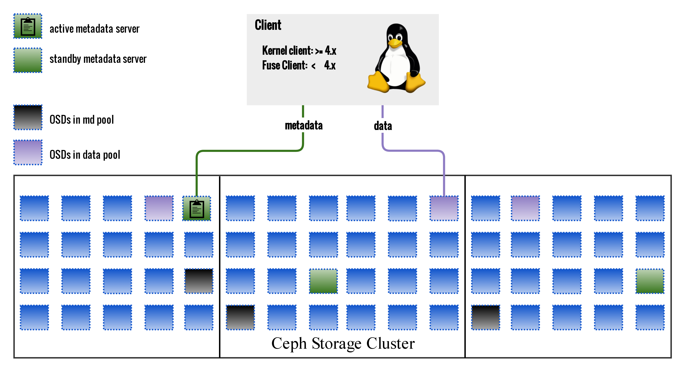
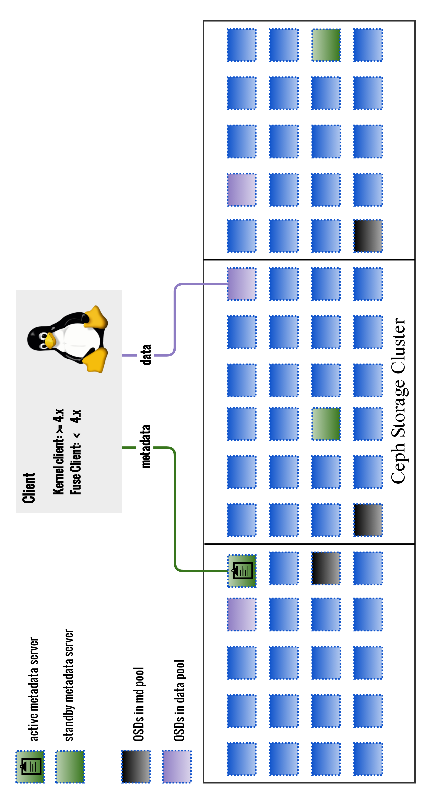

!SLIDE noprint
# Components

!SLIDE printonly
# Components

~~~SECTION:notes~~~
CephFS needs: 1x md pool, 1x data pool, 1+ MDS, Clients(Kernel or Fuse)

quadrates symbolize processes: OSD, MDS
~~~ENDSECTION~~~
