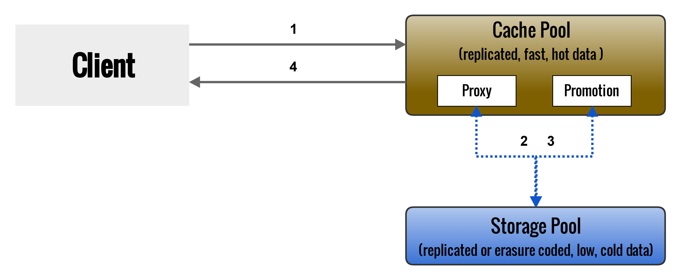

<!SLIDE> subsection
#~~~SECTION:MAJOR~~~ Ceph Cache Tier

!SLIDE noprint smbullets
# Objectives

* after this section you will know
 * the structure of ceph cache tiers
 * the benefits and disadvantages
 * how to deploy a cache tiered pool

!SLIDE
# Ceph Cache Tier
* Overlay pool with faster hardware
* can provide better I/O performance
* transparent to ceph-clients

!SLIDE noprint
# Holistic

!SLIDE noprint
# Schema

!SLIDE smbullets printonly
# Schema 

<!SLIDE>
# Available modes
* Writeback mode
 * writes and reads go to the cache pool
 * cache pool manages the promotion
* Read-proxy mode
 * every read is proxied to the storage pool
 * useful for disabling the cache

<!SLIDE>
# Caution!
* performance highly depends on workload
* difficult to benchmark
* slower if workload is not cache-tiering-friendly
* complexity, increases probability of hitting bugs

<!SLIDE smbullets>
# Workloads
Known Good Workload

* RGW time-skewed: Lots of reads go to recently written objects

Known Bad Workload

* RBD with replicated cache and erasure-coded base: probably small writes 4K to cold objects
* RBD with replicated cache and base: performs better, but struggles with the same problem

<!SLIDE> small
# Commands for creating a cache tier

<br\>

combine cache and storage pool

    # ceph osd tier add <storage-pool> <cache-pool>

set the mode 

    # ceph osd tier cache-mode <cache-pool> writeback

activate the cache

    # ceph osd tier set-overlay <storage-pool> <cache-pool>

~~~SECTION:notes~~~
~~~ENDSECTION~~~

<!SLIDE> small
# Age vs Temperature

set bloom filter for hit set tracking (what are my hot objects)

    # ceph osd pool set <cache-pool> hit_set_type bloom

the number of hits to store for cache pools

    # ceph osd pool set <cache-pool> hit_set_count 12

the duration for a hit set to be valid (in seconds)

    # ceph osd pool set <cache-pool> hit_set_period 14400
     

set read recency to promote  an object

    # ceph osd pool set <cache-pool> min_read_recency_for_promote 2
    # ceph osd pool set <cache-pool> min_write_recency_for_promote 2

Note: The longer and the higher the values are set, the more RAM is used by the OSD

<!SLIDE> small
# Cache Sizing

start flushing and evicting objects when count is reached

    # ceph osd pool set <cache-pool> target_max_bytes 1099511627776

or when number of objects is reached

    # ceph osd pool set <cache-pool> target_max_objects 1000000

<!SLIDE> small
# Relative Sizing

percentage relative to max bytes/objects set

begin flushing dirty at 40% (low watermark)

    # ceph osd pool set <cache-pool> cache_target_dirty_ratio 0.4

begin flushing dirty objects faster at 60%

    # ceph osd pool set <cache-pool> cache_target_dirty_high_ratio 0.6

begin to evict clean objects at least at 80%

    # ceph osd pool set <cache-pool> cache_target_full_ratio 0.8

<!SLIDE> small
# Cache Age

the time before the cache tier would flush/evict objects (seconds)

    # ceph osd pool set <cache-pool> cache_min_flush_age 600
    # ceph osd pool set <cache-pool> cache_min_evict_age 1800

<!SLIDE> small
# Remove Writeback Cache Tier

set cache-mode to forward (proxy)

    # ceph osd tier cache-mode <cache-pool> forward

ensure objects have been flushed

    # rados -p <cache-pool> ls
    # rados -p <cache-pool> cache-flush-evict-all

remove overlay (clients will use the storage-pool directly)

    # ceph osd tier remove-overlay <storage-pool>

separate the storage from the cache pool   

    # ceph osd tier remove <storage-pool> <cache-pool>
