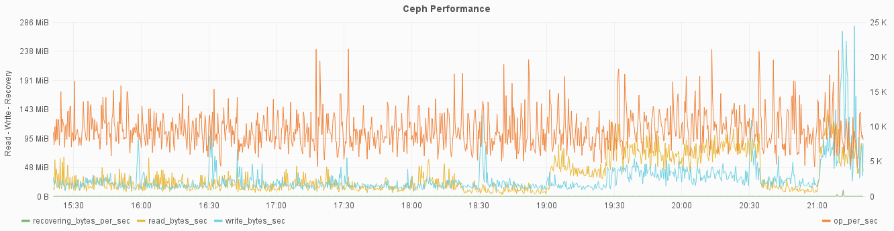
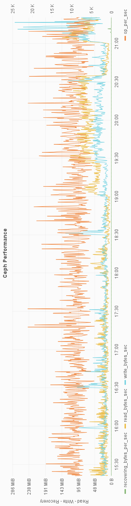
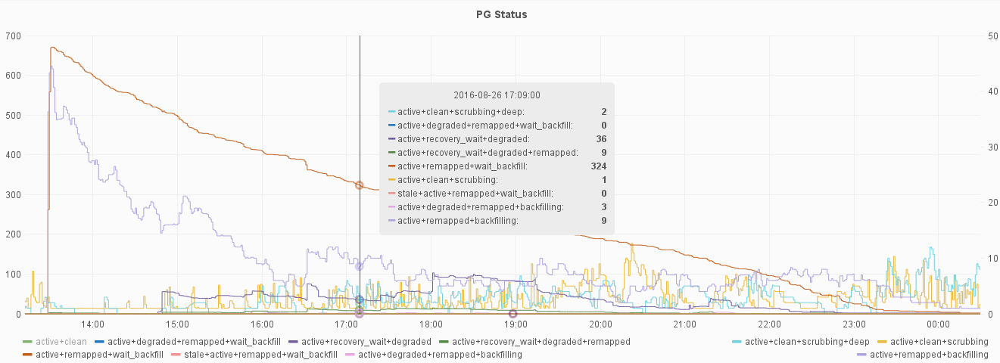
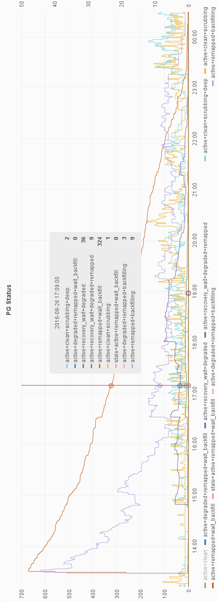
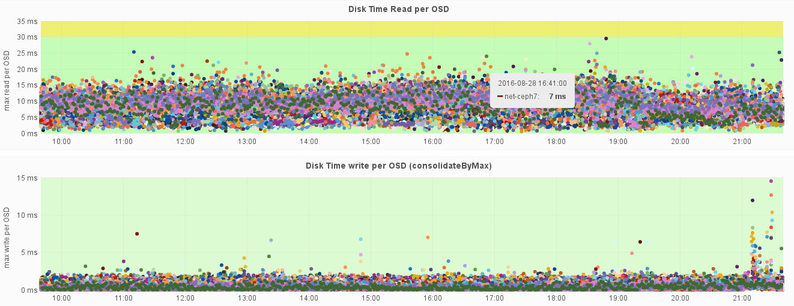
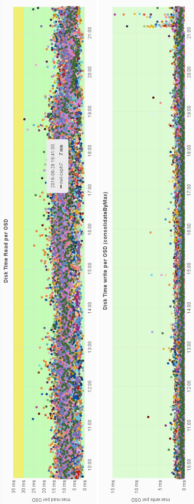
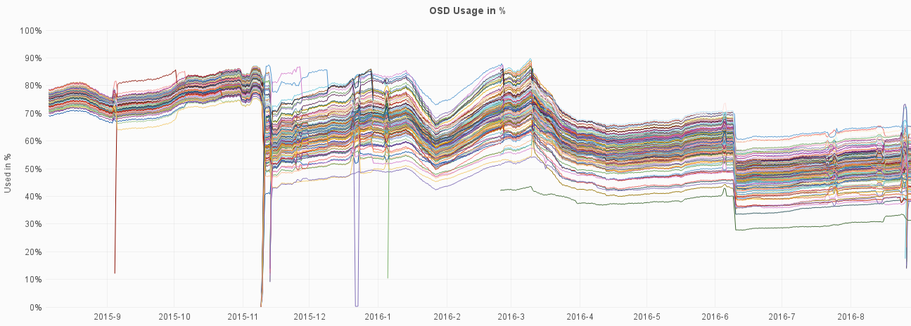
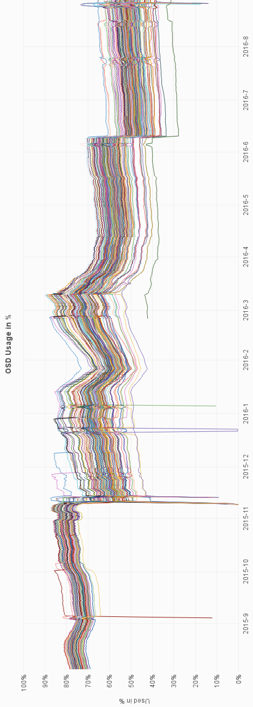

!SLIDE
#~~~SECTION:MINOR~~~ Metrics

!SLIDE noprint
# cluster performance metrics

    # ceph status -f json{-pretty}

!SLIDE printonly
# cluster performance metrics

    # ceph status -f json{-pretty}

!SLIDE noprint
# PGs state

    # ceph status -f json

!SLIDE printonly
# PGs state

    # ceph status -f json

!SLIDE noprint
# OSD performance

disk timings

!SLIDE printonly
# OSD performance
disk timings

!SLIDE noprint 
# OSD usage

disk usage

!SLIDE printonly
# OSD usage

disk usage

!SLIDE
# cluster usage

pool statistics

    # rados df --format json

 

    # ceph df --format json
