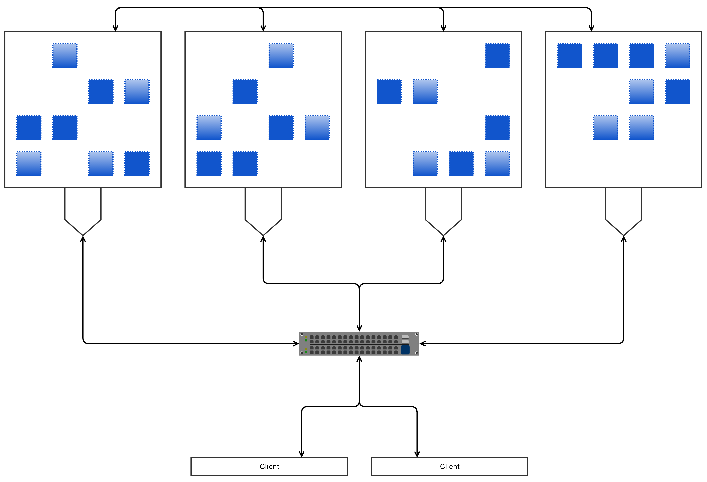

!SLIDE 
#~~~SECTION:MINOR~~~ Sizing

!SLIDE noprint
# Holistic

!SLIDE smbullets
# General

* mirroring of OS
* Luminous and Ubuntu 14.04 cumbersome
* enough space for logging
* Hands off /var/lib/ceph/mon/$/store.db

!SLIDE smbullets
# OSD

OSD

* 500MB for the process
* 1GB RAM per TB Storage
* middle CPU consumption (DualCore+) 
* disks (depends)
* SSD: 1 Core per OSD
* avoid RAID-Controller
* keep OSD upgrade in mind -> more RAM

!SLIDE smbullets
# Journal

Journal

* SSD should have a high throughput for sequential read/write
* 120 - 240GB is enough for small and mid-sized setups
* `osd journal size = 2 * (throughput * max sync interval)`
* `6GB = 2 * (100MB/s * 30)`
* no more need with OSD on SSD
* perhaps NVMe -> less slots occupied

~~~SECTION:notes~~~
Network speed vs. HDD speed

Consumer SSDs e.g. Intel 520/530/540 can be ok, Samsung EVO were dead sooner.
Improved with 3DNAND et. al.
~~~ENDSECTION~~~

!SLIDE smbullets
#Monitor + MDS

MDS

* 1GB RAM per process
* high CPU consumption (QuadCore+)

Monitor

* 1GB RAM per process
* low CPU consumption

~~~SECTION:notes~~~
transition to network
~~~ENDSECTION~~~
!SLIDE noprint
# Holistic

!SLIDE
# Network

* should be able to handle OSD bandwidth
* consider bandwidth for replication
* consider bandwidth for healing
* at least 2 1GB NICs (frontend + backend)
* enable Jumbo Frames
* matching MTU settings

!SLIDE
# Jewel vs. Luminous
* more focus on RedHat
* ceph mgr
* more plugins (zabbix)
* Dashboard

!SLIDE noprint
# Questions?
!SLIDE noprint
# Holistic

