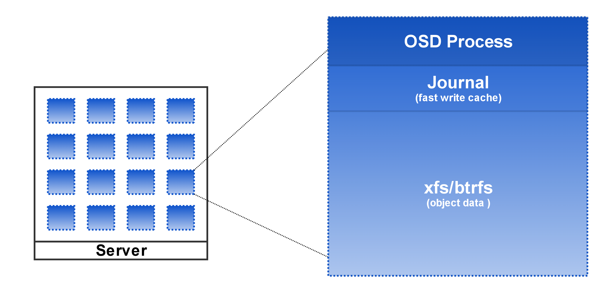
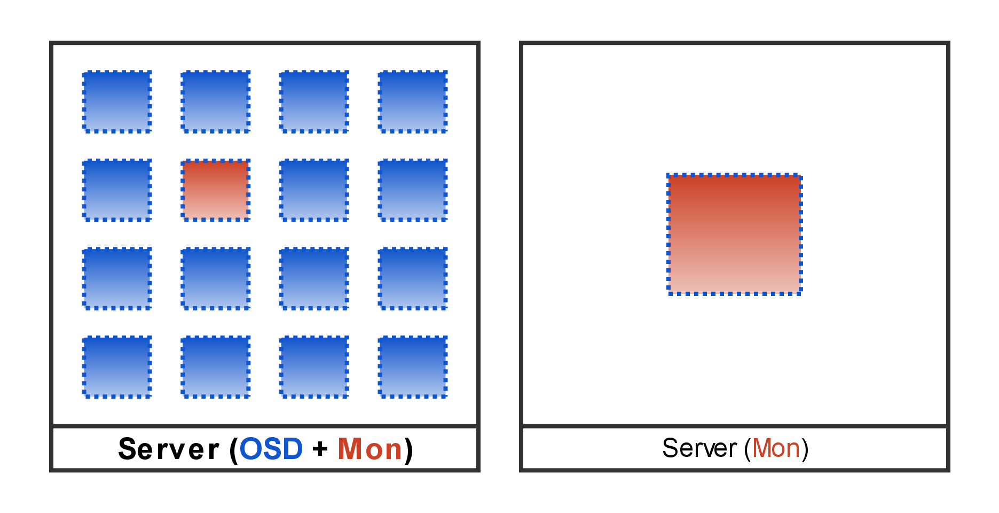

!SLIDE noprint

!SLIDE smbullets
# Object Storage Daemon (OSD)

* one single process managing the data on one single disk
* one server has many OSD processes
* replication and recovery

~~~SECTION:notes~~~
xfs: in production  
btrfs: would be better  
non-fs backend like leveldb are experimental at the moment (Jewel)  
Journal on SSDs or NVRAM  

communicate with each other and report unreachable OSD to MONs 
~~~ENDSECTION~~~

!SLIDE smbullets 
# Monitors

* know the cluster state (clustermap)
* form the quorum (should be an odd number)
* provide information to the client
 * do not provide any data

~~~SECTION:notes~~~
Clustermap: Mon-, OSD-, PG-, Crush- and MDS-Map 
  http://docs.ceph.com/docs/hammer/architecture/#cluster-map 
sends Clustermap to Clients. Essential for CRUSH 
Cluster consensus PAXOS Algorithm (good: small number of participants) 
check as unreachable reported OSDs and change Clustermap accordingly 
~~~ENDSECTION~~~

!SLIDE 
# Ceph Storage Cluster - OSDs + Monitors

