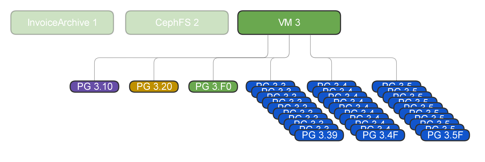
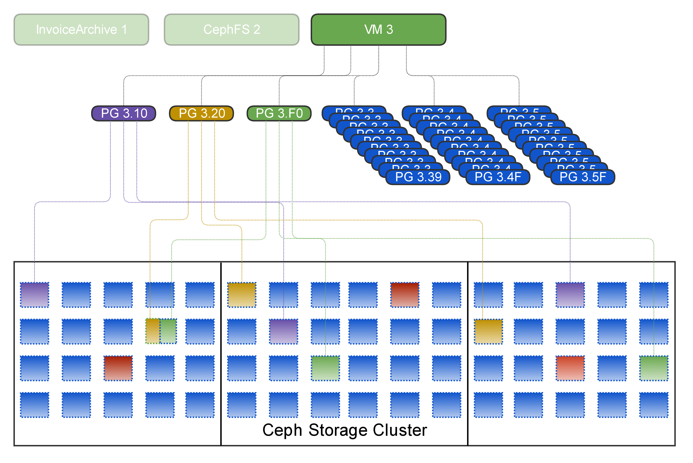
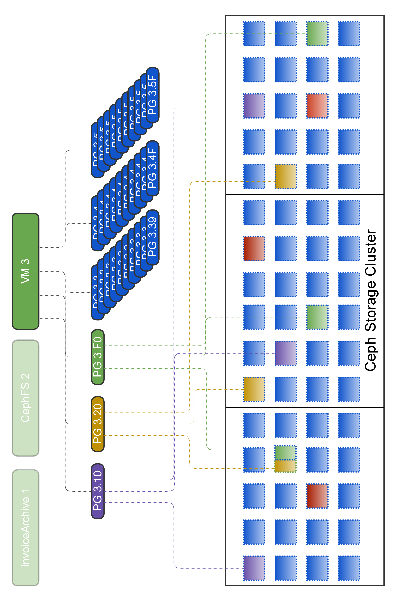

!SLIDE smbullets
# Pools 
 

* logical divided data
* has attributes like
 * number of replica
 * resilience
 * rules for data placement
* many pools share the same resources
* pool size is infinite

!SLIDE small
# Commands: manage pools

show pools

    # ceph osd lspools

create a pool
    
    # ceph osd pool create <name> <pg-num>

show pool usage

    # rados df

delete pool

    # ceph osd pool delete <name> --yes-i-really-really-mean-it (twice)

~~~SECTION:notes~~~
"#" indicates a CLI command, above is a short explanation
~~~ENDSECTION~~~

!SLIDE small
# Commands: pool attributes
 

get attributes

    # ceph osd pool get <name> size
    # ceph osd pool get <name> min_size
    # ceph osd pool get <name> crush_ruleset

 

set attributes

    # ceph osd pool set <name> min_size 1

~~~SECTION:notes~~~
"#" indicates a CLI command, above is a short explanation
~~~ENDSECTION~~~

!SLIDE smbullets
# Placement Groups

* logical collection of objects 
* Pools have many PGs
* Number of PGs is specified at creation time
* Number of PGs/OSD depends on number and size of OSDs
* OSDs get mapped to PGs

~~~SECTION:notes~~~
~~~ENDSECTION~~~

!SLIDE smbullets
# Placement Groups ctd.

* PGs get mapped to OSDs via CRUSH 
* the pool settings are used for the mappings, e.g. size 
* a single object is mapped to a PG by its name and pool ID 
* https://ceph.com/pgcalc

!SLIDE smbullets noprint
# Pools, PGs and OSDs 

~~~SECTION:notes~~~
transition to CRUSH -> how are data mapped to Pools, PGs, OSDs 
Please let participants rephrase the slides

all PGs for OSD 192: ceph pg dump | awk '{print $1"  "$15}' | egrep "\[.*192.*\]" | wc -l 
Info for one PG: ceph pg 4.0 query 
~~~ENDSECTION~~~

!SLIDE smbullets printonly
# Pools, PGs and OSDs 

!SLIDE smbullets noprint
# Lunch?! smoking break?!

 

<b> # yum update </b>
    

