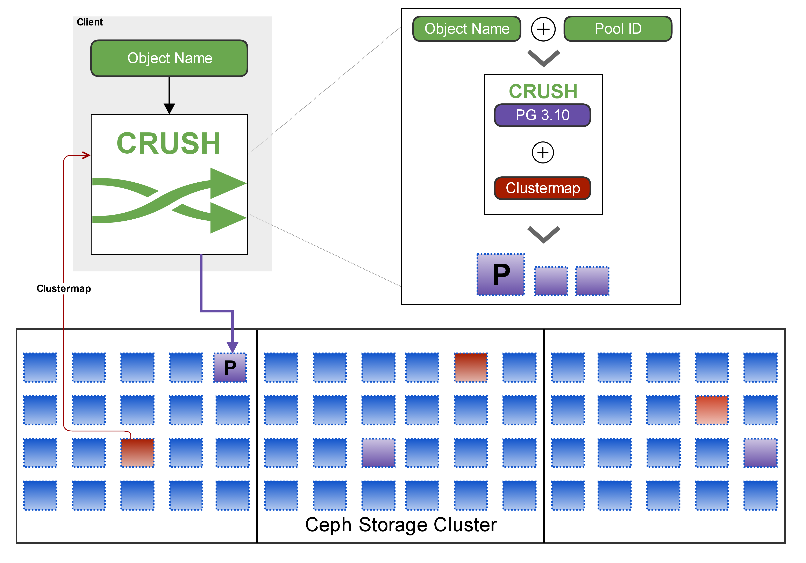
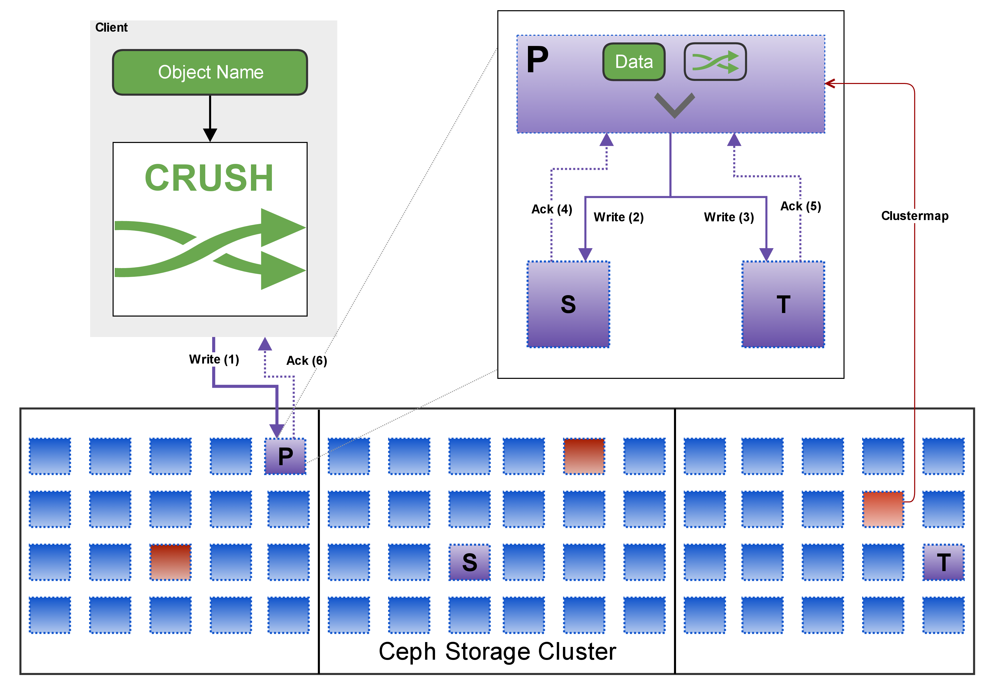
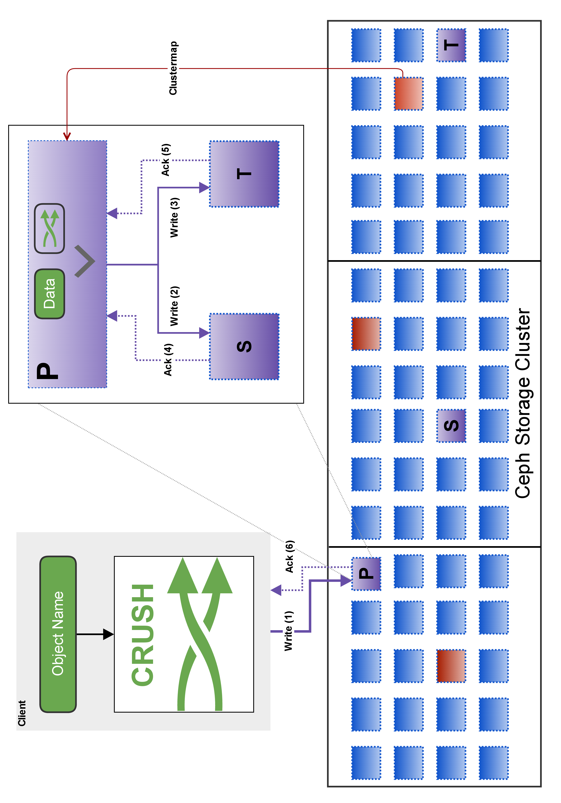
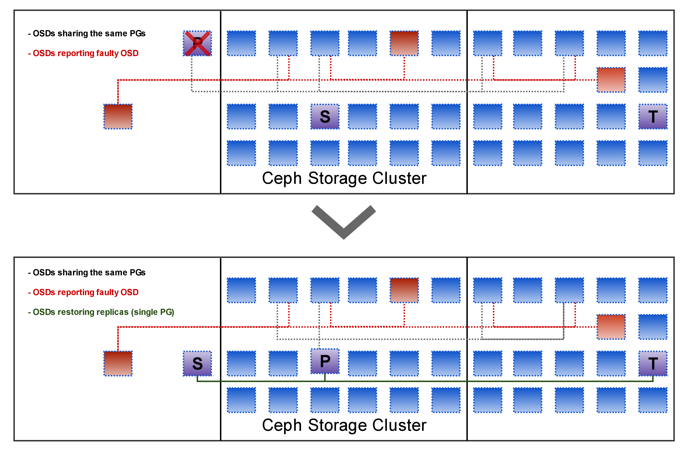
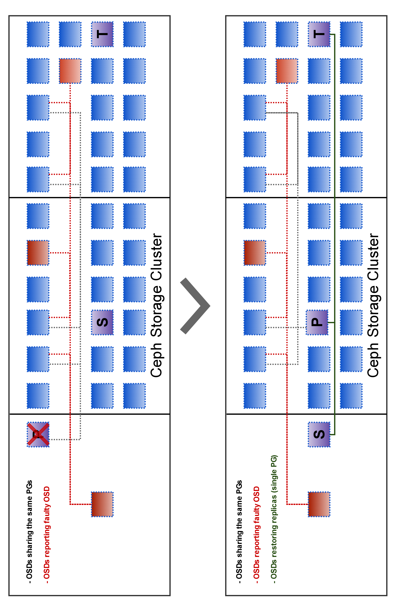
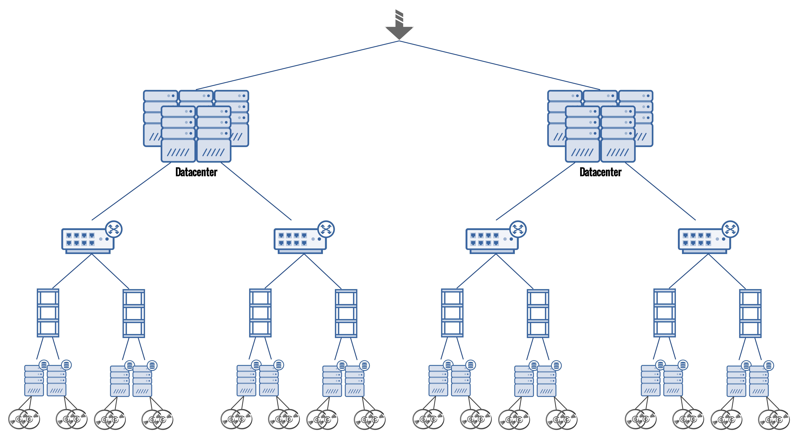
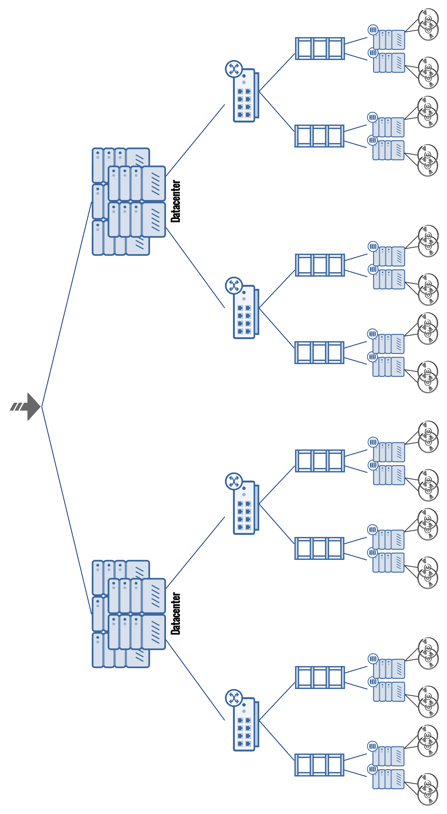

!SLIDE lrbullets small noprint
#~~~SECTION:MINOR~~~ CRUSH

   

!SLIDE lrbullets small printonly
#~~~SECTION:MINOR~~~ CRUSH

   

!SLIDE smbullets noprint
# Objectives

* after this section you will
 * know the benefits of CRUSH
 * understand the write processes within the Ceph Storage Cluster
 * know how to manipulate the Crush Map
 * know how to write Crush Rulesets
 * know how to use `crushtool` to build and test a Crush Map

!SLIDE smbullets
# CRUSH - 
# Controlled Replication Under Scalable Hashing

* a fast algorithm
* calculated on the client
* to get data placement (OSDs)
* avoids an intermediate broker
* enables direct communication between clients and OSDs
* can consider local conditions and failure domains, e.g. fire compartments

~~~SECTION:notes~~~
Controlled Replication under scalable Hashing 
Crush takes place on the client side. Input is Clustermap + Objectname + poolID 
Metadataserver (broker) Problems: Bottleneck, spof, lookup takes some time 
~~~ENDSECTION~~~

!SLIDE noprint

!SLIDE lrbullets noprint
# Write data

~~~SECTION:notes~~~
Hashing Problems: must be fast, gets more complicated with replica, distribution according to Failure Domains 
Input objects distributed according to Crushmap 
pool + hash(name) = 6.45 (PG); Crush(6.45) => OSDs 
writes/reads always against Primary OSD/ Journal. You can favorite OSD (e.g. SSD) -> Primary Affinity! 
If Primary fails, are Replica on secondary and tertiary OSD. Clustermap is rebuilt instantly.
~~~ENDSECTION~~~

!SLIDE lrbullets printonly
# Write data

!SLIDE noprint
# Write process

~~~SECTION:notes~~~
Write ACKs after write against Journal 
Explain Journal / WAL 
Stress Network FrontEnd and Backend again 
~~~ENDSECTION~~~

!SLIDE printonly
# Write process

!SLIDE smbullets noprint
# OSD failure

~~~SECTION:notes~~~
Example aims at one PG 
blacke Line: cimmunicating OSDs, because they share PGs 
red Line: OSDs report faulty OSDs 
monitors double-check and remove reported OSDs 
clients: send Requests against new primary 
OSDs: can restore replicas 
~~~ENDSECTION~~~

!SLIDE smbullets printonly
# OSD failure

!SLIDE smbullets
# OSD failure and states

each OSD can be in the state

* in or out
 * describes the cluster participation
* up or down
 * describes the connectivity

State changes on OSD failure

`in+up => in+down => out+down`

!SLIDE
# Crushmap 
* should reflect datacenter components
* CRUSH respects the crushmap for data placement
* part of clustermap

!SLIDE smbullets
# Crushmap - components

 

* rules
 * to define data placement and replication adjusted to your datacenter
* buckets (rack, switch, fire compartment, dc)
 * to map your storage cluster to your datacenter
 * racks, fire compartment, switches
* devices
 * hard disks used for the data storage

~~~SECTION:notes~~~
use next slide to explain again
~~~ENDSECTION~~~

!SLIDE noprint smaller

  

 # crushtool -o crushmap --build --num_osds 32 node straw 2 rack straw 2 switch straw 2 datacenter straw 2 root straw 0

 ~~~SECTION:notes~~~
show dataplacement 
 ~~~ENDSECTION~~~

!SLIDE printonly smaller
# Crushmap - hierarchy

 # crushtool -o crushmap --build --num_osds 32 node straw 2 rack straw 2 switch straw 2 datacenter straw 2 root straw 0

!SLIDE smaller noprint
# Crushmap - example (truncated)

 

[Download: crushmap.txt](../file/_files/share/crushmap.txt)

~~~FILE:share/crushmap.txt~~~

!SLIDE printonly smaller smaller
# Crushmap - example 

~~~FILE:share/crushmap.txt~~~

!SLIDE small
# Crushmap - rule

 

    rule simple-rule {
      ruleset 0
      type replicated
      min_size 2
      max_size 4
      step take default
      step chooseleaf firstn 0 type host
      step emit
    }

---

    step choose firstn <number> type <bucket>

    step chooseleaf firstn <number> type <bucket>

    <number> = 0: #replicas
    <number> > 0: #num
    <number> < 0: #replicas - #num

!SLIDE small
# Crushmap Commands: modify

 

extract crushmap

    # ceph osd getcrushmap -o map.current

decompile crushmap

    # crushtool -d map.current -o map.txt

compile crushmap

    # crushtool -c map.txt -o map.new

set crushmap

    # ceph osd setcrushmap -i  map.new
