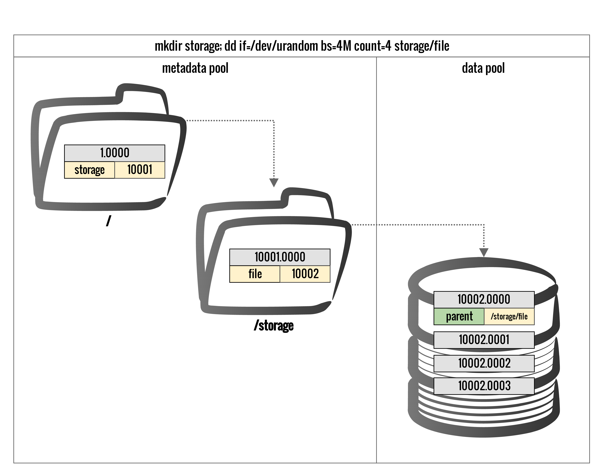
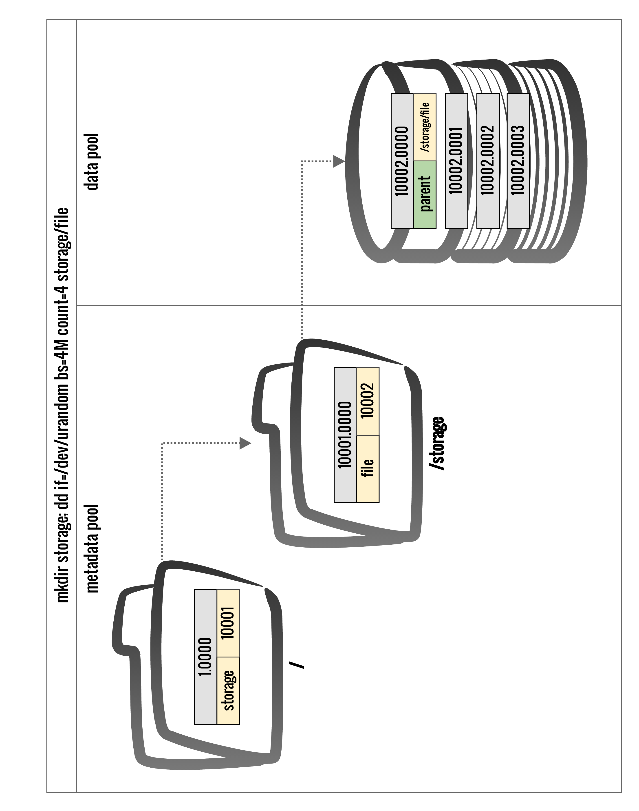

!SLIDE lrbullets 
# Metadata Server

* handles metadata 
* saves metadata in RADOS
* POSIX compatible interface
* does not provide data

!SLIDE lrbullets
# Metadata

* hierarchy
* permissions
* names
* timestamp
* owners
* modes

!SLIDE smbullets
# Objects 
* file content directly from the clients
* files are saved as object and get striped over objects
* objectname is the inode number of a file
* object names follow the schema `inode`.`offset`
* offset is used for files >4MiB

~~~SECTION:notes~~~
inode equals object name  
objects >4MB have a counter added
~~~ENDSECTION~~~

!SLIDE noprint
# Hierarchy

!SLIDE printonly
# Hierarchy

~~~SECTION:notes~~~
see TechTalk by John Spray 
metadatapool: directory entries are stored as key value as rados omap  
(currently one leveldb per osd). 
 
Objects comprise of 3 areas: XAttrs, LevelDB (one instance per OSD), Plain data

~~~ENDSECTION~~~

