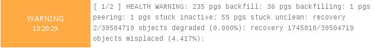
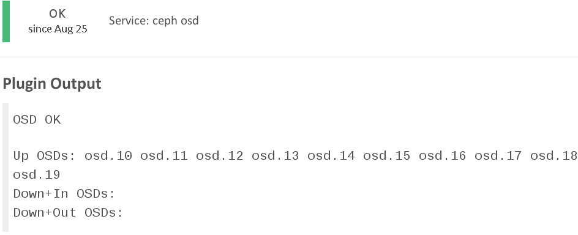
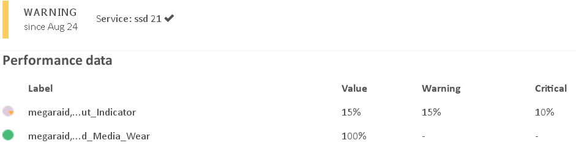

!SLIDE 
#~~~SECTION:MINOR~~~ Monitoring

!SLIDE smbullets
# ceph health

 

ceph status translated to Icinga states

 

* warning: action needed
* critical: outage of PGs (read-only, at best)

e.g. [ceph-plugins](https://github.com/valerytschopp/ceph-nagios-plugins)

!SLIDE
# ceph health osd

 

monitor all OSDs on a server

!SLIDE smbullets
# SSD monitoring

 

SSD journals - sentenced to death

 

* Intel: Media Wearout Indicator (100-0)
* Samsung: Wear Leveling Count (0+)
